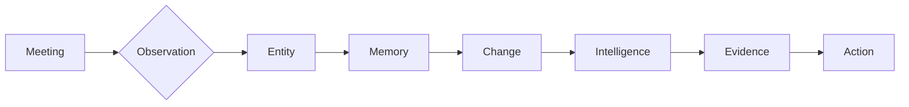
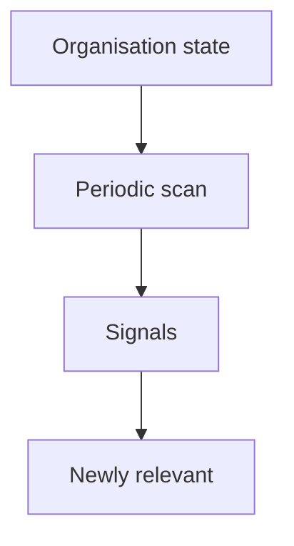
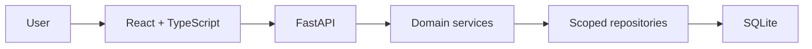
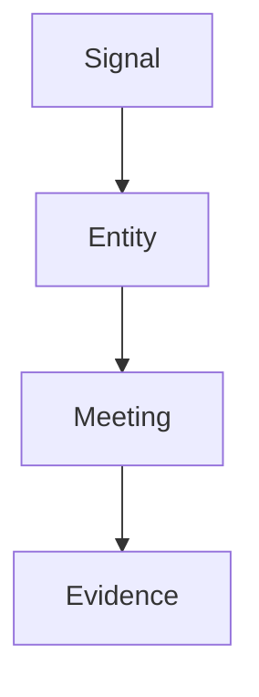
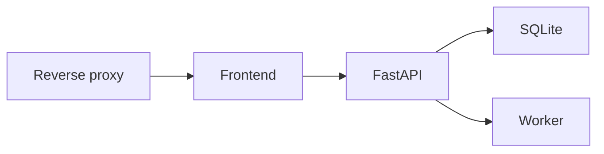

# ThreadLine

ThreadLine turns meetings and ongoing work into connected organisational memory - linking entities, history, changes, intelligence, evidence, and follow-up into one evidence-backed view you can actually ask questions of.

It answers the question that meeting notes never do: **"What is the state of this organisation, how did it get here, and what should we do next?"**

ThreadLine is built on a small, durable core: meetings are ingested once, facts are extracted deterministically, entities are resolved against evidence, change and risk are computed from verified state, and every answer is traceable back to the meeting transcripts that support it.


## Badges

| Framework | Standard | Lint | Test | E2E | Build |
|-----------|----------|------|------|-----|-------|
| Backend | Python 3.12 / FastAPI | ruff 1025 | pytest 1001 passed | 26 Playwright | green |
| Frontend | React 19 / Vite / TS 6 | tsc clean | vitest 176 passed | | green |

## What ThreadLine does

| Capability | Purpose |
|---|---|
| Meeting intelligence | Ingest meeting transcripts and recover structured, evidence-backed facts. |
| Information extraction | Deterministically extract issues, tasks, decisions and risks with supporting evidence. |
| Entity resolution | Resolve mentions to canonical entities via candidates, scoring and a safe resolution decision. |
| Organisational memory | Maintain durable, tenant-scoped memory of how each entity changed over time. |
| Change intelligence | Detect insights, changes and their impact across the organisation. |
| Attention & prioritisation | Score what needs attention now surfaces why, from durable evidence. |
| Dependency & impact | Infer co-occurrence relationships and cross-entity risk propagation without fabricating dependencies. |
| Semantic retrieval | Durable, tenant-scoped semantic evidence index over resolved meetings. |
| Natural-language query | Ask questions in plain language; answers are grounded in cited evidence. |
| Proactive intelligence | Recurring scans surface newly relevant, deterministic signals as they emerge. |
| Evidence & actions | Link every signal to evidence and recommend concrete next actions. |

## Follow the Thread

The name comes from the central idea: every observation is a point on a thread that runs from a meeting, through an entity, into memory, and back out as change, insight, evidence and action.



## Ask ThreadLine

Natural-language questions are answered by retrieval and grounding, not by guessing. A valid answer is one you can verify.


ThreadLine never pretends to understand language without limits. When the system cannot ground an answer in citable evidence, it says so rather than inventing a confident but unsupported response.

## Proactive Intelligence

The durable background worker periodically re-evaluates organisation state and flags newly relevant, deterministic signals. This is observation over time, not real-time monitoring and not predictive accuracy.



Proactive scans are off by default and opt-in: set `PROACTIVE_INTELLIGENCE_ENABLED=true`. They reuse the existing deterministic intelligence services - they never call a second engine and never fabricate signals.

## Architecture



ThreadLine is a **modular monolith** with **durable SQLite** and a **process-local durable worker**. No message broker, no distributed queue, no external cache.


The architecture principles are deliberately simple:

- SQLite is the durable source of organisational state.
- Derived intelligence (insights, memory, relationships, attention) is computed from source state, never the other way round.
- Tenant isolation is enforced at the repository boundary; every read and write carries the organisation scope.
- Background jobs are durable in SQLite and survive restarts.
- The worker derives the organisation scope from the durable job itself, never from request state.
- Semantic retrieval is derived data; the semantic index is rebuildable from durable mentions.
- LLM output never becomes organisational truth - it is treated as candidate evidence subject to resolution.

## Evidence-first intelligence

Every signal, insight and answer in ThreadLine connects back to the evidence that supports it. A timeline is only as trustworthy as the observations it was built from.



This is not a claim of perfection: ThreadLine is precise about what it knows and honest about what it does not. It prefers to abstain (return UNRESOLVED / AMBIGUOUS) rather than guess, and it refuses to present a fabricated dependency as fact.

## Tech stack

| Layer | Technology |
|---|---|
| Backend runtime | Python 3.12, FastAPI, Pydantic 2, Uvicorn |
| Storage | SQLite (durable source + durable jobs) |
| Extraction | Provider abstraction: OpenAI GPT-4o or deterministic fake |
| Embeddings | Provider abstraction: OpenAI or fake, representation-versioned |
| Semantic index | Durable, tenant-scoped JSON index (derived, rebuildable) |
| Natural-language query | Retrieval + grounding, evidence-cited answers |
| Proactive intelligence | Durable scan jobs on the process-local worker |
| Frontend | React 19, TypeScript, Vite, React Query, react-router |
| Testing | pytest (backend), Vitest + Testing Library (frontend), Playwright (E2E + axe) |
| CI / ops | GitHub Actions, uvicorn, nginx/Caddy reverse proxy |

## Project structure

```text
app/
  api/              FastAPI routers (auth, orgs, meetings, entities,
                    query, intelligence, jobs, attention, changes, portfolio)
  services/         Domain logic: extraction, resolution, temporal, memory,
                    insights, attention, correlation, impact, NL query,
                    proactive intelligence, rate limiting
  repositories/     Scoped (tenant-isolated) data access
  persistence/      SQLite store + migrations (schema v1-v6)
  providers/        Extraction / NL / embedding provider abstraction
  models/           Internal domain models
  schemas/          Stable public API schemas
  core/             Config (pydantic-settings)

frontend/
  src/              React app: auth, meetings, entities, intelligence,
                    ask, dashboard, attention
  e2e/              Playwright end-to-end tests

tests/              Backend pytest suite
scripts/            Operational helpers (e.g. smoke checks)
.github/workflows/  CI (frontend, backend, browser)
```

## Security & tenancy

- Authenticated sessions with server-side opaque tokens; passwords are PBKDF2-HMAC-SHA256 with per-user salts (no default credentials anywhere).
- Organisation-scoped access; every query carries the organisation scope and tenant isolation is enforced at the repository boundary.
- Role-aware permissions (`OWNER` / `ADMIN` / `MEMBER`) with a central permission policy.
- Tenant-scoped semantic retrieval; semantic index records are organisation-scoped and cross-tenant reads return `404` (no existence oracle).
- Durable background jobs carry organisation scope, so the worker never crosses tenants.
- Login is throttled (per-email rate limit) and the query API is rate-limited per user on a sliding window.
- Logging never includes tokens, transcripts or secrets.

ThreadLine is a young, single-node system. It documents what it verifies and does not over-claim.

## Deployment

Current deployment model is **single-node**: a reverse proxy in front of the production frontend build, proxying `/api/*` to a single FastAPI process over durable SQLite, with a process-local durable worker.



See [DEPLOYMENT.md](DEPLOYMENT.md) for the full runtime model, environment configuration, security and operations guidance.

## Quick start

### 1. Clone and create a virtual environment

```bash
git clone https://github.com/VIVEK-MARRI/ThreadLine.git
cd ThreadLine

# Windows
python -m venv .venv && .venv\Scripts\activate

# macOS / Linux
python3 -m venv .venv && source .venv/bin/activate
```

### 2. Install backend dependencies

```bash
pip install -r requirements.txt
```

### 3. Configure the provider (optional for real extractions)

Copy `.env.example` to `.env` and set `EXTRACTION_PROVIDER=openai` with an `OPENAI_API_KEY` to use real LLM extraction. No key? Set `EXTRACTION_PROVIDER=fake` - the API runs and the endpoint structure works without any LLM calls.

### 4. Run the backend

```bash
uvicorn app.main:app --reload
```

The API is served at `http://localhost:8000` with interactive docs at `/docs`.

### 5. Bootstrap the first organisation and owner

While no users exist, `POST /api/v1/auth/bootstrap` is open so the first owner can be created. The moment the first owner exists, anonymous access ends - there is no default password.

```bash
curl -X POST http://localhost:8000/api/v1/auth/bootstrap \
  -H "Content-Type: application/json" \
  -d '{"organisation_name": "Acme", "slug": "acme",
       "admin_email": "owner@acme.example", "password": "<your-strong-password>"}'
```

Then log in and call tenant-scoped endpoints with the bearer token, selecting your organisation via the `X-Organisation-ID` header. Set `AUTH_OPEN_BOOTSTRAP=false` after the first owner is created.

### 6. Run the frontend

```bash
cd frontend
npm ci
npm run dev        # dev server proxies /api and /health to the backend
```

## Testing

```bash
# Backend (no LLM key needed - extraction tests use a fake provider)
python -m pytest -q

# Frontend
cd frontend
npx tsc --noEmit    # typecheck
npm test            # unit tests (Vitest)
npm run build       # production build
npm run test:e2e    # Playwright end-to-end (26 tests)
```

## API overview

All routes are versioned under `/api/v1` and require authentication (tenant-scoped).

| Method | Route | Purpose |
|---|---|---|
| POST | `/api/v1/auth/bootstrap` | Create the first organisation + owner (open only while userless) |
| POST | `/api/v1/auth/login` / `logout` | Authenticate / end a session |
| POST | `/api/v1/meetings` | Ingest a meeting |
| POST | `/api/v1/meetings/{id}/extract` | Extract structured facts |
| POST | `/api/v1/entities` | Create a canonical entity |
| GET | `/api/v1/entities` | List entities |
| GET | `/api/v1/entities/{id}/insights` | Entity insights & change detection |
| GET | `/api/v1/entities/{id}/temporal` | Temporal state & timeline |
| GET | `/api/v1/entities/{id}/memory` | Organisational memory |
| GET | `/api/v1/entities/{id}/relationships` | Relationship intelligence |
| GET | `/api/v1/entities/{id}/impacts` | Cross-entity risk propagation |
| POST | `/api/v1/query` | Ask ThreadLine (evidence-grounded answers) |
| POST | `/api/v1/query/evidence` | Evidence-only retrieval |
| GET | `/api/v1/intelligence/scan-status` | Proactive scan status |
| GET | `/health` | Health check |

## Learn more

- [DEPLOYMENT.md](DEPLOYMENT.md) - production runtime, configuration, backup, operations
- [.env.example](.env.example) - all environment options
- `STAGE_34_FINAL_REPORT.md` - latest security hardening, proactive intelligence and rate-limiting work
- [CONTRIBUTING / design notes](.agent/skills/ui-ux-pro-max/SKILL.md) - optional; ThreadLine does not require agent skills to run or test
