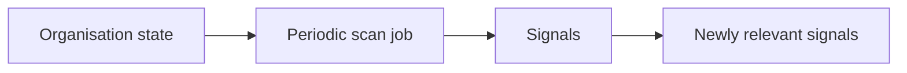
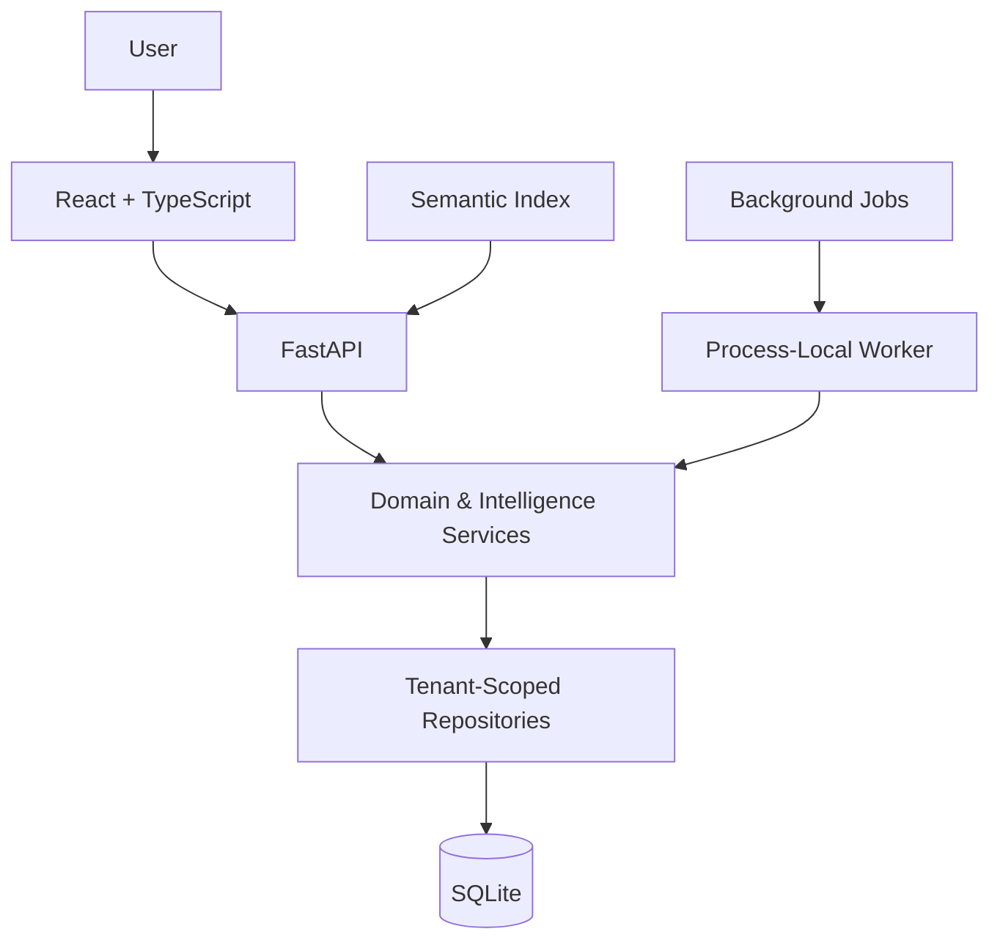

# ThreadLine

ThreadLine turns meetings and ongoing work into connected organisational memory — linking entities, history, changes, intelligence, evidence rapid, and follow-up into one view you can ask questions of.

It answers the question that meeting notes never do: **"What is the state of this organisation, how did it get here, and what should we do next?"**

It does this without pretending to know more than it has been shown. Every fact is extracted deterministically from evidence, every entity is resolved against candidates, every change is derived from verified state transitions, every insight points back to the meetings that support it, and every natural-language answer is grounded in citable evidence. ThreadLine prefers to abstain over speculate — an answer it cannot trace to evidence, it refuses to invent.

## Follow the Thread

The name comes from the central idea: every observation is a point on a thread that runs from a meeting, through an entity, into memory, and back out as change, intelligence, evidence and action.


## What ThreadLine does

| Capability | Purpose |
|---|---|
| Meeting intelligence | Ingest meetings and recover structured, evidence-backed facts. |
| Information extraction | Deterministically extract issues, tasks, decisions and risks, with supporting evidence. |
| Entity resolution | Resolve mentions to canonical entities via candidates, scoring and a conservative decision. |
| Organisational memory | Maintain durable, tenant-scoped memory of how entities changed over time. |
| Change intelligence | Detect changes, their impact ja, and cross-entity risk without fabricating dependencies. |
| Attention & impact | Prioritise what needs attention now and explain why, from durable evidence. |
| Dependency intelligence | Infer co-occurrence relationships and cross-entity risk propagation deterministically. |
| Semantic retrieval | Durable, tenant-scoped semantic index over resolved evidence. |
| Natural-language query | Ask questions in plain language; answers are grounded in cited evidence. |
| Proactive intelligence | Recurring scans surface newly relevant, deterministic signals as they emerge. |
| Evidence & actions | Every insight links back to evidence and recommends concrete next actions. |

"Ask ThreadLine" is the grounding boundary: a question becomes a retrieval plan, evidence is scored and cited, and the answer is built only on what can be verified. When evidence is insufficient, ThreadLine says so instead of guessing.

## Ask ThreadLine


## Proactive Intelligence

ThreadLine's durable worker can periodically re-evaluate organisation state and surface newly relevant deterministic signals. This is a scheduled re-scan of existing evidence, not real-time monitoring or push notifications.



Proactive intelligence is opt-in and off by default (`PROACTIVE_INTELLIGENCE_ENABLED=false`). When enabled, the worker schedules one durable scan job per organisation per interval, and each scan reports only genuinely new, deterministic signals — it never fabricates a discovery.

## Architecture

ThreadLine is a **modular monolith** with a **process-local durable worker** and **durable SQLite** as the source of truth. There is no separate message broker, no external queue, no distributed worker fleet, and no graph database.



Domain state, derived intelligence, semantic retrieval evidence, and durable jobs all live in one process boundary. The worker derives its organisation scope from the durable job it executes, never from request state, so tenancy is preserved as work moves off the request path.

### How intelligence is derived, not invented

- **Durable source first.** SQLite is the durable source of organisational state — meetings, entities, mentions and background jobs.
- **Derived, rebuildable views.** Changes, memory, insights, attention, relationships, impacts and the semantic index are computed deterministically from source state. Losing them never loses source data; they rebuild from it.
- **Evidence-backed.** Every insight and every natural-language answer links to the evidence that supports it, and every answer carries citations back to the transcript.
- **Tenancy at the boundary.** Repositories enforce organisation scope on every read and write; tenant isolation is structural, not a route-level convention.
- **Deterministic and read-only intelligence.** The intelligence services never mutate entities or fabricate facts; they compute from verified state and abstain when evidence is ambiguous.

## Security & tenancy

- **Authenticated sessions** — server-side opaque sessions with hashed tokens and expiry; no default or hardcoded credentials.
- **Organisation-scoped access** — members select their organisation via header, and membership is checked against real organisation state, never trusted blindly.
- **Tenant isolation at the repository boundary** — every repository operation carries the organisation scope; objects outside that scope read as `404`, not as a cross-tenant existence oracle.
- **Role-aware permissions** — central role policy (`AUTH_ROLE_PERMISSIONS`) distinguishes `OWNER`, `ADMIN` and `MEMBER`.
- **Tenant-scoped semantic retrieval** — vector search and the semantic index are scoped to the requesting organisation.
- **Durable job tenancy** — background jobs carry and derive their organisation scope from the durable job row, never from request state.
- **Login throttling** — repeated failed logins are rate-limited to resist brute force and credential stuffing.
- **Query rate limiting** — expensive natural-language query endpoints are rate-limited per user on a sliding window, returning `429` with a `Retry-After` header.

## Tech stack

| Layer | Technology |
|---|---|
| Backend | Python 3.12, FastAPI, Pydantic, SQLite |
| Provider abstraction | Deterministic fake + OpenAI extraction; fake + OpenAI embeddings |
| Background | Process-local durable worker over background jobs |
| Frontend | React 19, TypeScript, Vite, TanStack Query |
| Testing | Pytest (backend), Vitest (frontend), Playwright (E2E), ruff (lint) |
| CI | GitHub Actions (`CI` workflow) |

Only tools actually in the repository are listed.

## Project structure

```text
app/
  api/                FastAPI route modules (meetings, entities, auth, orgs,
                      query, intelligence, changes, jobs, attention)
  core/               Configuration (pydantic-settings, .env)
  models/             Internal domain models
  persistence/        SQLite store + schema migrations
  providers/          Provider abstractions (extraction, embeddings)
  repositories/       Tenant-scoped data access
  schemas/            API request/response schemas
  services/           Domain services: extraction, resolution, temporal,
                      memory, intelligence, attention, correlation,
                      semantic indexing, natural-language query
  api/query.py        Natural-language question + evidence retrieval
  api/intelligence.py Proactive intelligence scan status
  main.py             FastAPI app, router wiring, worker lifecycle

frontend/
  src/features/       React feature modules (meetings, entities, intelligence,
                      ask, actions, auth)
  src/test/           Frontend tests
  e2e/                Playwright end-to-end tests

tests/                Backend test suite
scripts/              Operational scripts
DEPLOYMENT.md         Deployment, configuration and operations guide
```

## Getting started

### Prerequisites

- Python 3.12+
- Node.js 22+
- `pip` and `npm`

### 1. Create a virtual environment and install dependencies

```bash
python -m venv .venv
# Windows
.venv\Scripts\activate
# macOS / Linux
source .venv/bin/activate

pip install -r requirements.txt
```

### 2. Configure the LLM provider (optional)

Copy `.env.example` to `.env`. ThreadLine runs without any LLM key using its deterministic fake providers:

```env
EXTRACTION_PROVIDER=fake        # "fake" (no key) or "openai"
NL_PROVIDER=fake                # "fake" or "openai"
SEMANTIC_INDEX_BACKEND=in_memory
```

Set `EXTRACTION_PROVIDER=openai` and add `OPENAI_API_KEY` only when you want real extractions. Everything else works out of the box.

### 3. Run the backend

```bash
uvicorn app.main:app --reload
```

The API is served at `http://localhost:8000`, with interactive docs at `http://localhost:8000/docs`.

### 4. Bootstrap the first organisation and owner

While no users exist, the API is open for the first owner through `POST /api/v1/auth/bootstrap`. The moment the first owner exists, anonymous access ends permanently — ThreadLine has no default admin and no default password.

```bash
curl -X POST http://localhost:8000/api/v1/auth/bootstrap \
  -H "Content-Type: application/json" \
  -d '{"organisation_name": "Acme", "slug": "acme",
       "admin_email": "owner@acme.example", "password": "<your-strong-password>"}'
```

Then log in, and call tenant-scoped endpoints with the bearer token, selecting your organisation via the `X-Organisation-ID` header.

### 5. Run the frontend

```bash
cd frontend
npm ci
npm run dev          # proxies /api to the backend on :8000
```

## Testing

```bash
# Backend — no LLM key needed (extraction tests use a fake provider)
python -m pytest -q

# Frontend — typecheck, unit tests, production build
cd frontend
npx tsc --noEmit
npm test
npm run build

# End-to-end (Playwright against the built frontend + real backend)
npm run test:e2e
```

## API overview

All routes live under `/api/v1` and require authentication. A few highlights:

| Method | Route | Purpose |
|---|---|---|
| POST | `/api/v1/auth/bootstrap` | Create the first organisation + owner while userless |
| POST | `/api/v1/auth/login` / `logout` | Log in / end a session |
| POST | `/api/v1/meetings` | Ingest a meeting |
| POST | `/api/v1/meetings/{id}/extract` | Extract structured facts |
| POST | `/api/v1/entities` | Create a canonical entity |
| GET | `/api/v1/entities/{id}/insights` | Entity insights, memory, change & attention |
| POST | `/api/v1/entities/mentions` | Register a mention |
| POST | `/api/v1/query` | Ask a natural-language question (grounded answers) |
| POST | `/api/v1/query/evidence` | Retrieve cited evidence for a question |
| GET | `/api/v1/intelligence/scan-status` | Proactive scan status |
| GET | `/api/v1/changes/summary` | Organisation change summary |
| GET | `/api/v1/attention` | Attention & prioritisation |
| GET | `/api/v1/portfolio` | Portfolio intelligence |
| GET | `/health` | Liveness |

## Documentation

- [DEPLOYMENT.md](DEPLOYMENT.md) — deployment model, configuration, and operations
- [.env.example](.env.example) — all configuration options
- [.github/workflows/ci.yml](.github/workflows/ci.yml) — the CI workflow (backend, frontend, browser)
