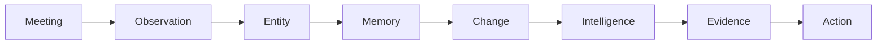
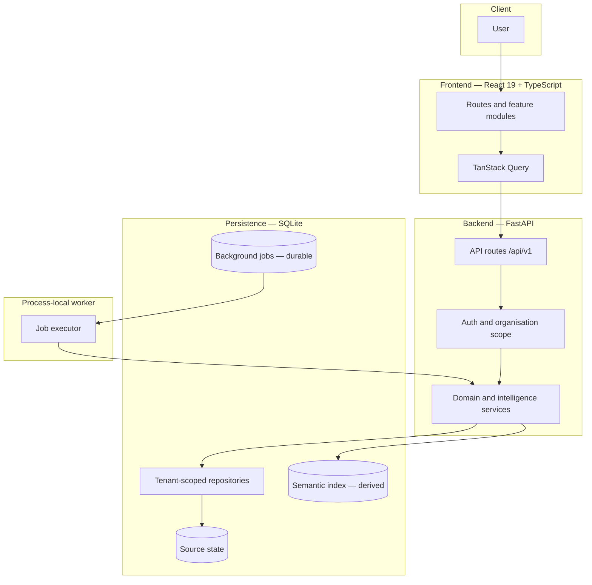
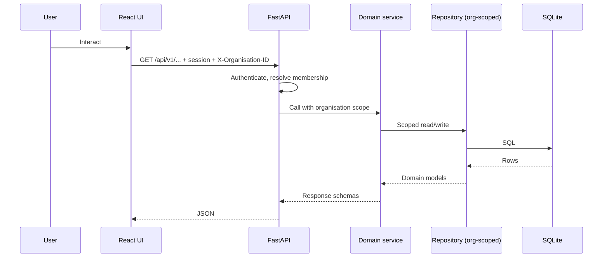
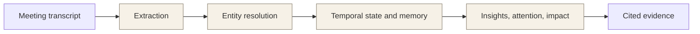
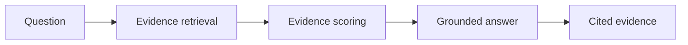

# ThreadLine

[](https://github.com/VIVEK-MARRI/ThreadLine/actions/workflows/ci.yml)
[](https://github.com/VIVEK-MARRI/ThreadLine/commits/main)
[](LICENSE)

[](app/)
[](app/main.py)
[](app/schemas/)
[](app/persistence/)
[](frontend/)
[](frontend/)
[](frontend/)
[](frontend/)

ThreadLine turns meetings and ongoing work into connected organisational memory —
so you can understand what changed, trace it back to evidence, and know where
follow-up exists.

It answers the question meeting notes never do: **what is the state of this
organisation, how did it get here, and what should we do next?** Every fact is
extracted deterministically from evidence, every change is derived from verified
state transitions, and every answer points back to the meetings that support it.
When evidence is insufficient, ThreadLine abstains instead of guessing.

## Follow the thread

Every observation is a point on a thread running from a meeting, through an
entity, into memory, and back out as change, intelligence, evidence, and action.



## Architecture

ThreadLine is a **modular monolith**: a React frontend, a FastAPI application
layer, tenant-scoped repositories over durable SQLite, and a process-local
durable worker. No message broker, no external queue, no distributed fleet.



A request travels from UI to source state through one scoped path:



Intelligence is a deterministic, read-only derivation over durable state —
never a mutation, never an invention:



Derived views (changes, memory, insights, attention, relationships, the semantic
index) are rebuildable from source state. Losing them never loses data.
Tenant isolation is enforced at the repository boundary: every read and write
carries the organisation scope, and background jobs derive theirs from the
durable job row — never from request state.

## What ThreadLine does

| Capability | How |
|---|---|
| Meeting intelligence | Ingest meetings, recover structured evidence-backed facts |
| Information extraction | Deterministic extraction of issues, tasks, decisions, risks |
| Entity resolution | Candidates, scoring, and a conservative resolution decision |
| Organisational memory | Durable, tenant-scoped history of how entities changed |
| Change intelligence | State transitions, impact, and cross-entity risk — no fabricated links |
| Attention | Prioritised signals explained by their evidence |
| Semantic retrieval | Tenant-scoped semantic index over resolved evidence |
| Natural-language query | Grounded answers with citations; abstains when evidence is thin |
| Proactive intelligence | Opt-in scheduled re-scans surfacing newly relevant signals |
| Evidence and actions | Every insight links to sources and recommends next actions |

Ask ThreadLine is the grounding boundary — retrieval, scoring, cited answer:



## Tech stack

| Layer | Technology |
|---|---|
| Backend | Python 3.12+, FastAPI, Pydantic 2, Uvicorn |
| Providers | Extraction and embeddings behind interfaces (deterministic fake or OpenAI) |
| Storage | SQLite — source state, semantic index, and durable jobs |
| Worker | Process-local durable executor over background jobs |
| Frontend | React 19, TypeScript 6, Vite, TanStack Query, React Router |
| Testing | Pytest, Vitest, Playwright, Ruff |
| CI | GitHub Actions ([ci.yml](.github/workflows/ci.yml)) |

Only tools actually in the repository are listed.

## Project structure

```text
app/
  api/            FastAPI route modules (auth, orgs, meetings, entities,
                  query, intelligence, changes, jobs, attention, portfolio)
  core/           Configuration (pydantic-settings, .env)
  models/         Internal domain models
  schemas/        Stable public API schemas
  services/       Domain logic: extraction, resolution, temporal, memory,
                  intelligence, attention, semantic indexing, NL query
  repositories/   Tenant-scoped data access
  persistence/    SQLite store and schema migrations
  providers/      Extraction and embedding provider abstractions
  main.py         App wiring, router registration, worker lifecycle
frontend/
  src/features/   Feature modules (dashboard, meetings, entities,
                  intelligence, ask, actions, auth, landing)
  src/components/ Shared UI, layout, and feedback primitives
  e2e/            Playwright end-to-end suite
tests/            Backend pytest suite
scripts/          Operational helpers
```

## Quick start

Prerequisites: Python 3.12+, Node.js 22+.

```bash
# Backend
python -m venv .venv
# Windows: .venv\Scripts\activate | macOS/Linux: source .venv/bin/activate
pip install -r requirements.txt
uvicorn app.main:app --reload        # http://localhost:8000 (/docs for API reference)

# Frontend (new terminal)
cd frontend
npm ci
npm run dev                          # http://localhost:5173, proxies /api to :8000
```

No LLM key is needed: ThreadLine runs on deterministic fake providers out of
the box (`EXTRACTION_PROVIDER=fake`). Set `EXTRACTION_PROVIDER=openai` with an
`OPENAI_API_KEY` only for real extractions. See [.env.example](.env.example).

Create the first organisation and owner while the server is userless (anonymous
access ends permanently once an owner exists — there are no default credentials):

```bash
curl -X POST http://localhost:8000/api/v1/auth/bootstrap \
  -H "Content-Type: application/json" \
  -d '{"organisation_name": "Acme", "slug": "acme",
       "admin_email": "owner@acme.example", "password": "<your-strong-password>"}'
```

Then log in and pass the bearer token with your organisation via the
`X-Organisation-ID` header.

## Testing

```bash
# Backend (fake providers — no LLM key needed)
python -m pytest -q

# Frontend: typecheck, unit tests, production build
cd frontend
npx tsc --noEmit
npm test
npm run build

# End-to-end (Playwright, real backend + production build)
npm run test:e2e
```

## API overview

All routes live under `/api/v1` and require authentication after bootstrap.

| Method | Route | Purpose |
|---|---|---|
| POST | `/api/v1/auth/bootstrap` | First organisation + owner (open only while userless) |
| POST | `/api/v1/auth/login`, `/logout` | Session management |
| POST | `/api/v1/meetings` | Ingest a meeting |
| POST | `/api/v1/meetings/{id}/extract` | Extract structured facts |
| POST | `/api/v1/entities` | Create a canonical entity |
| GET | `/api/v1/entities/{id}/insights` | Insights, memory, change, attention |
| POST | `/api/v1/entities/mentions` | Register a mention |
| POST | `/api/v1/query` | Grounded natural-language answer |
| POST | `/api/v1/query/evidence` | Cited evidence for a question |
| GET | `/api/v1/intelligence/scan-status` | Proactive scan status |
| GET | `/api/v1/changes/summary` | Organisation change summary |
| GET | `/api/v1/attention` | Prioritised attention |
| GET | `/api/v1/portfolio` | Portfolio intelligence |
| GET | `/health` | Liveness |

## Security and tenancy

- Server-side opaque sessions, hashed tokens, no default credentials
- Organisation scope on every repository operation; out-of-scope reads return 404
- Role-aware permissions (`OWNER` / `ADMIN` / `MEMBER`) from a central policy
- Tenant-scoped semantic retrieval and durable job execution
- Login throttling and per-user sliding-window rate limits on query endpoints
- No tokens, transcripts, or secrets in logs

## Documentation

- [DEPLOYMENT.md](DEPLOYMENT.md) — runtime model, configuration, operations
- [.env.example](.env.example) — all environment options
- [STAGE_35_FINAL_REPORT.md](STAGE_35_FINAL_REPORT.md) — latest landing-page work
- [Interactive API docs](http://localhost:8000/docs) — served by the running backend

## License

[MIT](LICENSE) — Copyright (c) 2026 Vivek Marri.
